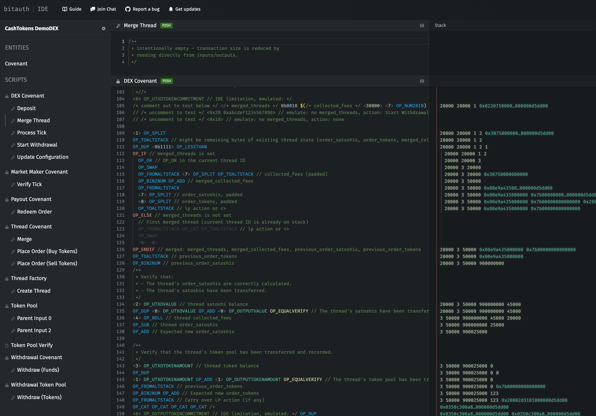

# JEDEX

Jedex – **Joint-Execution Decentralized Exchange** – is a technical demonstration of a decentralized exchange built on Bitcoin Cash using [CashTokens](https://github.com/bitjson/cashtokens).

[Review contracts in Bitauth IDE &rarr;](https://alpha.ide.bitauth.com/import-gist/d78b6b8e7fd4f621c5f80a00c7b79cf7)

- [Summary](#summary)
- [Liquidity Provider (LP)](#liquidity-provider-lp)
- [Order Handling](#order-handling)
- [Market Making Algorithm](#market-making-algorithm)
- [Future Work](#future-work)
  - [Limit Orders](#limit-orders)
  - [Thread Splitting](#thread-splitting)
  - [Managed Threads](#managed-threads)
  - [Deterministic Lifecycle Transactions](#deterministic-lifecycle-transactions)
- [Demonstrated Concepts](#demonstrated-concepts)
- [Jedex Token API](#jedex-token-api)
- [Transaction Flow](#transaction-flow)

## Summary

Jedex allows users to trade between BCH and a fungible token (FT) using a constant product market making algorithm. To improve liquidity and minimize both slippage and spend races, trades occur in large batches – a "tick" – approximately every 2 hours (configurable). Users submit orders prior to each tick, and all orders are aggregated with the funds/tokens already in the liquidity pool to determine the settlement price for the tick. This design reduces the trading advantage of miners and well-connected nodes.

[](https://alpha.ide.bitauth.com/import-gist/d78b6b8e7fd4f621c5f80a00c7b79cf7)

[Review contracts in Bitauth IDE &rarr;](https://alpha.ide.bitauth.com/import-gist/d78b6b8e7fd4f621c5f80a00c7b79cf7)

## Liquidity Provider (LP)

Jedex is created and funded by a Liquidity Provider (LP); the LP provides a pool of BCH and fungible tokens with which the DEX operates, and the LP is paid by trading fees. The LP can add to this pool at any time, but LP withdrawals are only processed after the next tick (to prevent liquidity from being reduced between the time a user places an order and the order is processed).

Because LP administration is controlled by an administrative non-fungible token (NFT), it is possible for the LP to be an on-chain entity – an LP-management covenant could allow the public to "buy in" to the LP, issue shares, pay dividends, and conduct votes on Jedex management actions. This highlights the composability of CashToken-based decentralized applications.

## Order Handling

When users place orders, they receive an order receipt NFT that will allow them to claim their purchase after the next tick. If the user sold FTs, they may claim BCH; if the user purchased FTs, they may claim the FT amount purchased and a refund of any excess BCH submitted (based on the final settlement price for the tick).

Order receipts can be redeemed at any time after that tick has been settled: Jedex "spins off" a new Payout Covenant every tick, and any user with a valid receipt for that tick may redeem their purchase/proceeds forever into the future. When the last redemption is made from a particular Payout Covenant, the covenant is consumed.

Jedex is a [multithreaded covenant](https://github.com/bitjson/cashtokens#multithreaded-covenants) with 4 threads – child covenants that accumulate orders between each tick. Immediately before each tick, each thread must be merged into the primary covenant to aggregate all orders. After the tick completes, new threads are created and order submission is re-opened.

To minimize the chance of attempting to spend a thread UTXO at the same time as another user, all user wallets should submit orders to a randomly-chosen thread UTXO. This minimizes accidental conflicts in which multiple users attempt to build on the same thread with a conflicting transaction. With only 4 threads, and given typical transaction propagation speed (~99% at 2 seconds), users can still expect negligible UTXO contention at usage rates up to 2 trades per second on a single instance of this Jedex; unrelated transactions don't impact this rate, and additional threads could be added to reduce contention for higher usage rates. In cases where an order is not accepted (because another transaction already spent the thread UTXO), wallets should immediately re-submit the order to the same thread.

To make denials of service expensive, order submission requires a fixed fee of 10,000 satoshis; fees are accumulated in the primary covenant at each tick and may be withdrawn by the LP at any time. To ensure ticks can be easily closed in adversarial conditions, each thread is also limited to 100,000 total orders.

## Market Making Algorithm

The Jedex architecture can support a wide variety of market making algorithms; this implementation uses a Constant Product function: `pool_tokens * pool_satoshis = fixed_constant`. Notably, because Jedex aggregates liquidity for every market tick, slippage for any particular order can be significantly minimized by other orders within the same tick (in a sense, pool sizes grow dynamically based on intra-tick demand); in this context, even the relatively-simple Constant Product function offers better liquidity than much more complex pricing functions used within other decentralized exchange designs.

Because BCH VM numbers are limited to 8 bytes, a naive Jedex implementation would fail with pool and order sizes for which the constant product is larger than `9223372036854775807`; this implementation carefully manages computations to remain within 8 bytes, so pools and orders may include an unlimited satoshi (BCH) value. However, this implementation **does not support fungible tokens with a total supply greater than `2^55`**. (Note that the maximum satoshi value is less than `2^53`, so tokens with larger supplies are likely excessively divisible.)

Tokens with larger supplies than `2^55` may be supported by Jedex in two ways: 1) a more complex market maker implementation emulating higher precision math, or 2) a simple, Higher-Denomination Token Equivalent (HDTE) issued by a trustless covenant – users can e.g. trade 1,000,000 fungible tokens for 1 HDTE token, make trades on a HDTE Jedex, and later trade their HDTE tokens with the trustless covenant to redeem the original token at the 1,000,000-to-1 ratio.

<details>
<summary>Formulas</summary>

```js
/**
 * Settle trades.
 *
 * This demo uses a simple Constant Product Market Maker (CPMM): the market maker always
 * offers to buy at a price such that a constant remains unchanged:
 * constant_product = pool_satoshis * pool_tokens
 *
 * So the last price offered by the market maker was:
 * previous_satoshis_per_token = pool_satoshis / pool_tokens
 *
 * And for this tick, the price offered will be:
 * satoshis_per_token = (pool_satoshis + order_satoshis) / (pool_tokens + order_tokens)
 *
 * And the LP's ~0.29% fee is applied:
 * fee = satoshis_per_token * 12 / 4096
 * buy_price_per_token = satoshis_per_token + fee
 * sell_price_per_token = satoshis_per_token - fee
 *
 * Precise payouts for orders are handled by the payout covenant, so
 * this covenant is charged only with computing the tick's settlement price,
 * handing over all the tokens and satoshis that the payout covenant will need,
 * and ensuring the liquidity pool is given its expected new balances.
 *
 * Notably, it's possible for buyers to have "bid" a satoshi amount that is not
 * perfectly divisible into tokens. We offer a small refund of the remainder
 * (and even small refunds can often cover the payout transaction fee).
 *
 * So we need to compute:
 * payout_tokens = order_satoshis / buy_price_per_token
 * payout_satoshis_refunds = order_satoshis % buy_price_per_token
 * payout_satoshis_sales = order_tokens * sell_price_per_token
 * payout_satoshis = payout_satoshis_sales + payout_satoshis_refunds
 *
 * (Note that this algorithm preferences satoshis as money: satoshis_per_token
 * should never be less than 1. For information on supporting less valuable tokens,
 * see "Market Making Algorithm" in the template description.)
 *
 * # Demo notes:
 * For this demo, only market orders are supported. Notably, this changes
 * the behavior of the market to encourage price ramping against naive traders:
 * the ramper copies the order of the trader, then reverses in the next tick.
 * Large ramping activities can be countered by placing a smaller decoy trade
 * in the opposite of the planned direction, waiting for ramping activity to build
 * liquidity in that direction, than placing a trade against the increased liquidity.
 *
 * In production, this "market orders only" demo would probably behave a little
 * like a poker table; working through strategies and counterstrategies is non-trivial.
 * However, rather than spending more time analyzing this example, it probably makes
 * more sense to focus on a more realistic production algorithm. See
 * "Future Work: Limit Orders" in the template description for a summary of the
 * how this market making algorithm will be adapted for production.
 */
```

</details>

# Future Work

Below are a few planned features that should be considered for inclusion in a production implementation of this DEX.

## Limit Orders

With a few additions, this architecture can also support limit orders: users place deposits in an "order book" tree of quantized Limit Price covenants, receiving a Limit Order Receipt NFT.

To support limit orders, a new Limit Order Covenant is placed under each Thread Covenant – the Limit Order Covenant is only used in the Thread Covenant's limit order code path, but the Thread Covenant must always be included to collect the order fee and issue a limit order receipt NFT (most logic is contained in the Limit Order Covenant to minimize transaction sizes for other Thread Covenant code paths).

The Limit Order Covenant maintains a bitfield (in an NFT commitment) representing the thread's view of the order book – one bit is assigned for each quantized limit price in the order book. As limit orders are placed, the thread OP_ANDs each limit price's identifier (a bit string with a single bit set). To support greater than 320 limit prices (the standard 40 byte NFT commitment), multiple bitfields can be used (such that each limit price has both a "bitfield number" and bit within that bitfield).

To process limit orders, the state of each thread's limit order covenant is merged into the top level DEX Limit Order Covenant. When the tick is processed, market orders first eliminate each other, then any additional market order volume cascades through the limit price covenants on the respective side (without CHIP-loops, this requires an additional transaction for each non-empty limit price). The aggregated limit order bitfield is stepped across to only "visit" active limit price covenants. At each step, the market maker first absorbs all orders up to the limit price, then the limit order is filled to the extent possible (and another Limit Payout Covenant is issued). This process continues until 1) the market maker offers better pricing than the next-highest limit price 2) a limit order is only partially filled, or 3) all limit orders are exhausted (and the market maker absorbs the remaining orders).

To facilitate payouts, all payout covenants must maintain minting tokens, and limit order payout covenants must maintain additional information about order fill percentage (all users with limit orders in a partially-filled limit price are filled to the same percentage; the remaining order percentage may still be filled in future ticks). Users withdraw their funds/tokens from each respective payout covenant – many users will have assets in only one covenant, but users who placed large market orders that encountered multiple limit prices will have partial payouts across multiple covenants. In the case of partial fills and partial payouts, each payout covenant must modify the user's receipt NFT to reflect the new balances that the user is owed (and in the case of market orders, an additional bitfield representing the payout covenants with which the receipt has already been redeemed).

Limit order cancellations require one tick to process – this prevents limit order holders from removing liquidity after market buyers have committed to orders in a particular tick. To cancel a limit order, the user places a limit cancellation order on a thread, their limit order receipt NFT is modified to indicate the cancellation, and the limit price covenant adds the cancellation to the "pending cancellation" balance. After the next tick is processed, if any funds remain in the limit price covenant, a limit cancellation payout covenant is produced. If the limit price covenant is not impacted by the tick (so no limit cancellation payout covenant is produced), any further limit cancellations placed for that limit price covenant (using a thread) must first produce a limit cancellation payout covenant for the completed cancellations (before new cancellations are accepted). Users holding limit order receipt NFT that were pending cancellation for the proper min_mtp can then withdraw any unfilled portion of their cancelled limit order by returning the NFT to the limit cancellation payout covenant.

Finally, the fee schedule surrounding limit orders – the fixed limit order placement fee and limit order execution fee percentage – is made modifiable in the Update Configuration LP administrative action (described above). Note: because limit orders remain active across ticks, it is important that wallets either 1) monitor for fee rate changes when a limit order is active, or 2) only employ limit orders on Jedexs where the LP admin NFT is managed by a reputable entity or a covenant.

## Thread Splitting

For simplicity, this implementation spawns exactly 4 threads after each market tick. A slightly more complex implementation could instead spawn one initial thread with the ability to split recursively. Each new pair of threads would have a 1-bit longer identifier, and once min_mtp has passed (and thread merging becomes possible), pairs of threads may be merged into their parent once each child thread has no descendants, accumulating their state and balances at each level.

Thread splitting may be its own code path (with an associated fee), or it may be triggered by each order placed. To avoid excessive thread splitting and reduce the cost of merging, thread splitting should require at least the network fee necessary to merge the resulting threads. By requiring thread merges to fund themselves (without a user-provided input/output for network fees), spend races are reduced (any two entities will produce the same set of thread merging transactions given the same mempool view at min_mtp).

## Managed Threads

For highly-active markets, a facility for managed threads can help to reduce contention: a facilitator spawns a managed thread (by e.g. paying a slightly larger fee) and receives a managed thread NFT. To build on the managed thread, each order must include the managed thread NFT as an input (and output). The facilitator (e.g. a Jedex-compatible wallet provider) can accept orders from its own users, ensuring all orders are committed to the managed thread linearly; this prevents spend races from confusing some user's wallets into building on a transaction that will be replaced in the next block (forcing the wallet to retry the order).

## Deterministic Lifecycle Transactions

For simplicity, this implementation requires most DEX lifecycle events (e.g. `Merge Thread`, `Process Tick`) to be funded by the entity that advances the market state. In practice, because BCH network fees are negligible, this requires some entity to be willing to spend ~5000 satoshis to resolve each tick (and all other users free-ride on this action).

It's reasonable to assume that some user will be willing to pay these network fees – users are required to pay a larger fixed fee in every order, and all users' funds/tokens are tied up in the covenant until the tick is resolved. However, covenant lifecycle events become possible after `min_mtp`, and any listening user may create and broadcast the transaction to perform the lifecycle event; if multiple entities simultaneously attempt this with their own network fee funding inputs, while both lifecycle events will produce the same results, the transactions themselves will conflict in the mempool of other users. Until a block is found, some portions of the network may build on lifecycle event transactions that will be replaced when the next block is found, impacting user experience (requiring users to retry orders).

A more complex implementation could require all lifecycle events to pay for their own network fees such that all lifecycle transactions can be created deterministically (and expected network fee rates could be configurable by the `Update Configuration` LP action). This wouldn't completely eliminate such spend races; a malicious miner can still occasionally add their own activity immediately before a conflicting set of lifecycle events, forcing users to retry any orders placed after the now-invalid lifecycle event transactions. However, deterministic lifecycle transactions could significantly reduce unintentional mempool divergence.

# Technical Details

This section includes technical details about the implementation.

## Demonstrated Concepts

Jedex was created primarily as a technical demonstration – the contract constructions and state management techniques used include:

- **Covenant tracking tokens** – Because it is impossible to falsify a token of the category used by the Jedex instance, covenants can authenticate each other by reading the commitments of tokens held by other spent UTXOs – even when separated by multiple transactions. Most Jedex covenants utilize tracking tokens for mutual authentication.
- **Commitment-based state management** – Most Jedex covenants maintain state using NFT commitments; this eliminates the need to manually inject state into the covenant's next locking bytecode, reducing contract and transaction sizes. (Exception: the `Payout Covenant` is more efficient with locking bytecode-embedded state, as this eliminates the need for a depository covenant and slightly reduces the number of contract operations required.)
- **Cross-covenant messaging** – Covenants transfer information to other covenants by including messages about their internal state in their mutable or minting token. This allows other covenants to more efficiently read and act on the internal state.
- **Depository covenants/token pools** – A single output may contain tokens of only one category; if a covenant needs to maintain a token of the Jedex internal token category, it cannot also hold tokens of another category (like the external tokens being traded). To enable covenants to maintain incompatible pools of tokens, the covenants are assigned child depository covenants (a.k.a "token pools") – child covenants that hold the incompatible tokens and must be moved in the same transaction as their parent covenant. With depository covenants, a single covenant can manage any number of tokens from any number of categories.
- **Role tokens** – The Liquidity Provider authenticates to the covenant using an [LP "admin" NFT](#liquidity-provider-admin-token) identifying them as the administrator (rather than e.g. providing a public key). This enables composition with other covenants: another covenant can maintain control of the admin NFT to ensure that some external protocol is followed, like a decentralized "LP management" corporation.
- **Token-unlocked covenants** – Any collected fees and processed liquidity pool withdrawals are automatically placed in the `Withdrawal Covenant` after every market tick. The liquidity provider may then withdraw funds/tokens from the `Withdrawal Covenant` at any time by producing a transaction including the LP token.
- **Multithreading & thread covenants** – Rather than requiring all users to interact with a single current covenant UTXO, application state is broken up into many different "thread" UTXOs ("multithreading"); each thread accepts orders from users, and threads are merged back into the `DEX covenant` immediately before the market tick is processed.
- **Bitfield validation** – Threads are identified by their ID, a bit in a bitfield held in each [thread NFT commitment](#thread-covenant). This makes set validation very efficient: the thread IDs are `OP_OR`ed together during thread merging.
- **Empty unlocking bytecode** – Only one Jedex contract requires unlocking bytecode; most contracts read values directly from inputs and outputs to validate the spend (preventing duplication and reducing transaction sizes).
- **Lifecycle transactions** – Lifecycle transactions can be created by any user and allow the contract to enter a new processing state. In Jedex, lifecycle transactions merge the threads into the top level covenant, process all orders for the epoch, and then re-open trading.
- **Token capability upgrading/downgrading** – Threads must always maintain a minting token in order to mint order receipts for customers, but the top-level covenant only requires a minting token to create new threads. By downgrading to a mutable token between market ticks, the validation requirements for most code paths is reduced. (Notably, deposits can have multiple inputs and outputs, offering greater flexibility to external LP management covenants.)
- **Redeemable NFTs** – State is offloaded from the thread covenants to users by including data in redeemable NFTs (order receipts). These order receipts not only allow the covenant to later authenticate the user for payouts, the receipts themselves carry information about the order, allowing the payout covenant to calculate what each user is owed using only its settlement price.
- **Delayed action requests** – LPs can take actions that impact the market: withdraw from the liquidity pool, update the fee schedule, or shut down the exchange. Instead of empowering LPs to surprise users with these actions, all actions must be requested by the LP in the previous period. Actions are performed automatically only after the next settlement is complete.
- **Coupled covenants/logic offloading** – The `Market Maker Covenant` is loosely-coupled to the `DEX covenant`: the DEX covenant has several code paths that do not require the `Market Maker Covenant`, but the `Market Maker Covenant` can only be spent in transactions with the `DEX covenant`. By offloading logic used for the less-common "Verify Tick" code path to the `Market Maker Covenant`, the `DEX covenant` can reduce transaction sizes in the common case. Likewise, the `Market Maker Covenant` can rely on the DEX covenant for some validation, dedicating more bytes to the offloaded logic without exceeding VM limits. (This demonstrates that clusters of coupled covenants can be used to support much more complex validation than can be accomplished within the VM-imposed limits for an individual contract).
- **Spin-off covenants** – During each market tick, a new payout covenant is produced; the payout covenant allows any user with an order receipt matching that tick to claim their token purchases or proceeds. By "spinning off" these payout covenants, the primary covenant has no need to maintain historical information or even to continue serving customers: the payout covenant is a trust from which users can claim what they are owed forever into the future. (When the last user is paid out, the covenant is consumed.)
- **Covenant factories** – Thread covenants are produced by thread "factories", covenants that produce a fixed set of interlocking covenants as outputs. While this requires another setup transaction, it allows the produced covenants to eliminate a code path during validation, saving ~10 bytes per thread transaction and significant reducing network fees over the life of the thread.
- **Token API single-byte bias** – The Jedex token API is carefully arranged to differentiate most tokens within the first byte of the token commitment, and these bytes overwhelmingly use identifiers that can be pushed in a single byte of locking bytecode (`OP_1` through `OP_16` and `OP_1NEGATE`).

# Jedex Token API

Jedex has one internal token category (minting capability required), and supports trading of a single external token category (no capabilities required). For client-verifiable security, the internal token category must be created in the [Jedex creation transaction](#creating-a-jedex-instance).

- [Minting Tokens](#minting-tokens)
  - [DEX Covenant (Upgraded)](#dex-covenant-upgraded)
  - [Thread Covenant](#thread-covenant)
  - [Thread Factory](#thread-factory)
- [Mutable Tokens](#mutable-tokens)
  - [DEX Covenant (Downgraded)](#dex-covenant-downgraded)
  - [Market Maker Covenant](#market-maker-covenant)
- [Immutable Tokens](#immutable-tokens)
  - [Liquidity Provider Admin Token](#liquidity-provider-admin-token)
  - [Withdrawal Covenant Tracking Token](#withdrawal-covenant-tracking-token)
  - [Payout Covenant Tracking Token](#payout-covenant-tracking-token)
  - [Order Receipt Token](#order-receipt-token)

## Minting Tokens

Minting tokens of the Jedex category are fully covenant-controlled.

### DEX Covenant (Upgraded)

`DEX Covenant` – the DEX's root covenant – has a minting token while threads are being merged; the token is downgraded to mutable after the next set of thread factories is produced.

```
Commitment Structure:
merged_threads (1 byte) collected_fees (7 bytes, padded) order_satoshis (7 bytes, padded) order_tokens (8 bytes, padded) [lp_action (1 byte) lp_action_details (variable bytes)]
```

`merged_threads` is the result of `OP_OR`ing the `thread_id` of merged threads together. It may have values from `0b0001` (`1`) to `0b1111` (`15`).

### Thread Covenant

`Thread Covenant`s maintain minting tokens throughout their lifetimes.

```
Commitment Structure:
thread_id (1 byte), epoch_min_mtp (4 bytes), collected_fees (variable, up to 7 bytes)
```

In this implementation, there are 4 available `thread_id`s:

- `0b0001` (`1`)
- `0b0010` (`2`)
- `0b0100` (`4`)
- `0b1000` (`8`)

### Thread Factory

`Thread Factory` holds a minting token that is given to its produced `Thread Covenant`. The `Thread Factory` commitment structure is equivalent to that of `Thread Covenant`.

## Mutable Tokens

Mutable tokens of the Jedex category are fully covenant-controlled.

### DEX Covenant (Downgraded)

`DEX Covenant` has a mutable token during normal operation (until a thread is merged – then the token is upgraded to minting).

```
Commitment Structure:
lp_action (1 byte identifier) [`lp_action_details` (variable bytes)]
```

`lp_action` identifiers:

- None: `0x10` (`0b01_0000`)
- Start Withdrawal: `0x20` (`0b10_0000`)
  - `lp_action_details`: satoshis (7 bytes, padded), tokens (variable bytes)
- Update Configuration: `0x30` (`0b11_0000`)
  - `lp_action_details`: (not yet implemented)

### Market Maker Covenant

```
Commitment Structure:
0x01 (1)
```

## Immutable Tokens

Jedex issues both covenant and user-controlled immutable tokens.

### Liquidity Provider Admin Token

A single `Liquidity Provider Admin Token` is issued in the Jedex creation transaction.

```
Commitment Structure:
0x81 (-1)
```

### Withdrawal Covenant Tracking Token

A single `Withdrawal Covenant Tracking Token` is issued in the Jedex creation transaction.

```
Commitment Structure:
0x10 (16)
```

### Payout Covenant Tracking Token

`Payout Covenant Tracking Token`s are issued to the new `Payout Covenant` created during every Jedex tick.

```
Commitment Structure:
0x0f (15)
```

### Order Receipt Token

A new `Order Receipt Token` is issued to the user during every order placement (`Place Order`).

```
Commitment Structure:
action (1 byte) epoch_min_mtp (4 bytes) action_details (variable bytes)
```

`action` identifiers:

- Buy: `0x01` (`1`)
  - `action_details`: `satoshis` (variable bytes)
- Sell: `0x02` (`2`)
  - `action_details`: `token_amount` (variable bytes)

# Transaction Flow

This sections describes the types of transactions used in Jedex.

- [Creating a Jedex Instance](#creating-a-jedex-instance)
- [Thread Creation](#thread-creation)
- [Place Order](#place-order)
- [Merge Thread](#merge-thread)
- [Process Tick](#process-tick)
- [Redeem Order](#redeem-order)
- [LP Deposit](#lp-deposit)
- [LP Administrative Actions](#lp-administrative-actions)
  - [Start Withdrawal](#start-withdrawal)
  - [LP Withdrawal](#lp-withdrawal)
  - [Update Configuration](#update-configuration)

## Creating a Jedex Instance

A Jedex instance is created with the following genesis transaction structure, initializing the covenant as if a previous tick has just been processed (note the similarity to [`Process Tick`](#process-tick)):

```
Inputs:
  [...any]
Outputs:
  0. DEX Covenant [mutable: empty state]
  1. DEX Token Pool
  2. Withdrawal Covenant (excess BCH)
  3. Withdrawal Token Pool (excess tokens)
  4. Market Maker Covenant
  5. Thread Factory [minting; id:0b0001]
  6. Thread Factory [minting; id:0b0010]
  7. Thread Factory [minting; id:0b0100]
  8. Thread Factory [minting; id:0b1000]
  9. LP output [immutable: Admin NFT]
  (no other outputs)
```

Before interacting with a particular Jedex instance, wallets must either validate this genesis transaction or outsource such validation to a trusted party. Improperly instantiated instances may behave unexpectedly (e.g. burning or stealing funds/tokens).

## Thread Creation

Thread factories are covenants that can produce a Jedex thread with the following transaction structure:

```
Inputs:
  0. Thread Factory
  [...any]
Outputs:
  0. Thread Covenant [minting]
  1. Thread Token Pool
  2. Change output (excess BCH, no tokens)
  (no other outputs)
```

Any user can generate a thread from a thread factory, and any particular thread factory can remain unused throughout a tick. Unused thread factories must be merged like all other threads.

## Place Order

Users may place orders in any thread with the following transaction structure:

```
Inputs:
  0. Thread Covenant
  1. Thread Token Pool
  [...any]
Outputs:
  0. Thread Covenant
  1. Thread Token Pool
  2. Change output (excess BCH, Jedex receipt NFT)
  3. Token change output (excess tokens) [optional]
  (no other outputs)
```

## Merge Thread

After a block is mined that advances the network's Median Time Past (MTP) beyond the minimum for the current tick, the DEX covenant allows threads (and thread factories) to be merged with the following transaction structure:

```
Inputs:
  0. DEX Covenant [mutable or minting]
  1. DEX Token Pool
  2. Thread Covenant/Thread Factory [minting]
  3. Thread Token Pool
  [...any]
Outputs:
  0. DEX Covenant [upgrade to minting]
  1. DEX Token Pool
  2. Change output (excess BCH, no tokens)
  (no other outputs)
```

## Process Tick

After all threads are merged, the tick can be processed with the following transaction structure:

```
Inputs:
  0. DEX Covenant [minting]
  1. DEX Token Pool
  2. Withdrawal Covenant
  3. Withdrawal Token Pool
  4. Market Maker Covenant
  [...any]
Outputs:
  0. DEX Covenant [mutable: empty state]
  1. DEX Token Pool
  2. Withdrawal Covenant
  3. Withdrawal Token Pool
  4. Market Maker Covenant
  5. Payout Covenant (payout BCH, payout tokens)
  6. Thread Factory [minting; id:0b0001]
  7. Thread Factory [minting; id:0b0010]
  8. Thread Factory [minting; id:0b0100]
  9. Thread Factory [minting; id:0b1000]
  10. Change output (excess BCH, no tokens)
  (no other outputs)
```

## Redeem Order

Each tick produces a Payout Covenant from which all users with trades executed in that order may withdraw (in any order, at any time in the future). The final user to withdraw their funds/tokens may destroy the covenant.

```
Inputs:
  0. Payout Covenant
  1. (any) [immutable: Order Receipt NFT]
  [...any]
Outputs:
  0. Payout Covenant
  1. (any) (payout tokens/BCH; no NFT)
```

## LP Deposit

The DEX covenant may receive Deposit transactions to the LP's pool without the admin NFT (this offers greater flexibility for higher-level, LP-management covenants):

```
Inputs:
  0. DEX Covenant [mutable]
  1. DEX Token Pool [no NFT]
  [...any]
Outputs:
  0. DEX Covenant [mutable]
  1. DEX Token Pool [no NFT]
  [...any] (for excess BCH/tokens)
```

## LP Administrative Actions

Liquidity provider (LP) administrative actions require the LP's Admin NFT and are processed after the next tick. In this implementation, only one administrative action may be performed per tick (to simplify contracts and reduce transaction sizes).

### Start Withdrawal

LP withdrawals are processed after the next tick and must be initiated before any threads have been merged (while the DEX Covenant NFT has only the mutable capability). They are initiated with the following transaction structure:

```
Inputs:
  0. DEX Covenant [mutable]
  1. DEX Token Pool
  2. (any) [immutable: Admin NFT]
  [...any]
Outputs:
  0. DEX Covenant [mutable: 0x00 max_withdrawal_satoshis (7 bytes, padded) max_withdrawal_tokens (8 bytes, padded)]
  1. DEX Token Pool
  2. any (excess BCH) [immutable: Admin NFT]
  (no other outputs)
```

### LP Withdrawal

After each tick is settled, any fees collected and the pending liquidity pool withdrawals (if present) are deposited in the Withdrawal covenant. The balances in the withdrawal covenant may be moved at any time with the following transaction structure:

```
Inputs:
  0. (any) [immutable: Admin NFT]
  1. Withdrawal Token Pool
  2. Withdrawal Covenant
  [...any]
Outputs:
  0. (any) [immutable: Admin NFT]
  1. Withdrawal Token Pool
  2. Withdrawal Covenant
  [...any]
```

### Update Configuration

Jedex configuration (minimum_tick_interval_mtp_seconds and fee_divisor) can be modified after the next tick. A configuration update can be initiated with the following transaction structure:

```
Inputs:
  0. DEX Covenant [mutable]
  1. DEX Token Pool
  2. LP output [immutable: Admin NFT]
  [...any]
Outputs:
  0. DEX Covenant [mutable: 0x01 minimum_tick_interval_mtp_seconds fee_divisor ]
  1. DEX Token Pool
  2. change output (excess BCH) [immutable: Admin NFT]
  (no other outputs)
```
